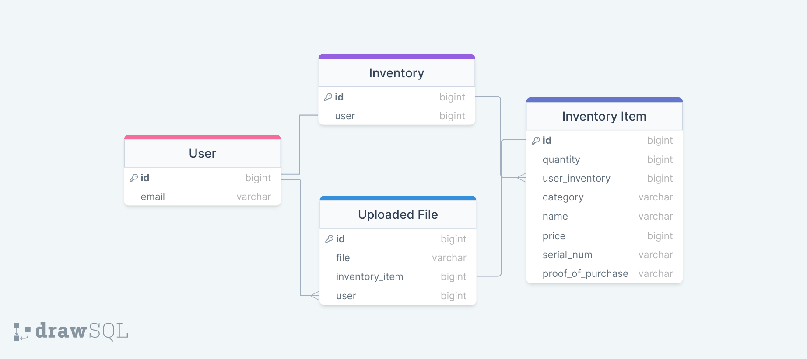

# Asset Management Application

## Problem Statement
When disaster strikes and your stuff is lost, stolen, or destroyed, it can be a frustrating experience to try and make an insurance claim for the full value of your personal property. This application will make it easy to catalogue your possessions in order to make an effective insurance claim or warranty claim.

## Features

### APIs
-OpenAI: Provide dynamic text parsing of scanned documents. This is used in combination with Tesseract OCR to auto-populate item entries based on uploaded proof of purchase documents.  
-Disify: Verify whether user emails are authentic.
 
### CRUD
Users have the ability to perform all CRUD operations on items in their inventory.

### Filesystem
Because proof of purchase is necessary for insurance companies to process a claim, the application will have to incorporate filesystem storage of user-scanned receipts, with a corresponding URL entry in the associated database item

### Structure

## Architecture

### DB Schema
